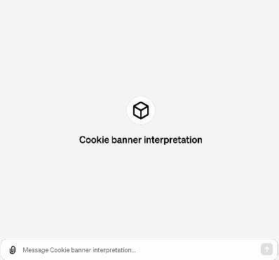

# User Privacy Preference Management System

This repository contains supplementary materials to the paper "A User-Centered Privacy Policy Management System for Automatic Consent on Cookie Banners".

## GPTs

Example output from trained LLM models.

### Cookie banner identification

### Cookie banner interpretation

## Firefox Extension

The extension is composed of three files: `manifest.json`, `background.js`, `content.js`.

- **Manifest File (`manifest.json`)**: This file contains metadata about the extension, such as its name, version, and which scripts to run.
- **Background Script (`background.js`)**: This script will listen for when a user navigates to a new page and then execute the content script after a delay.
- **Content Script (`content.js`)**: This script will contain the JavaScript core code, which will be executed on the webpage.

### Setup

- Open Firefox
- Go to `about:debugging`
- Click on `This Firefox`
- Click on `Load Temporary Add-on...`
- Select the `manifest.json` file in the `extension-firefox` folder of this repository
- Click on `Open` from the file dialog

The extension is now loaded and can be used.

## Demo

A user who has installed the web extension and whose policy is ACCEPT P visits the Quantcast website. Execution of actions to apply the policy begins after 3 seconds, with a 100ms delay between actions.

